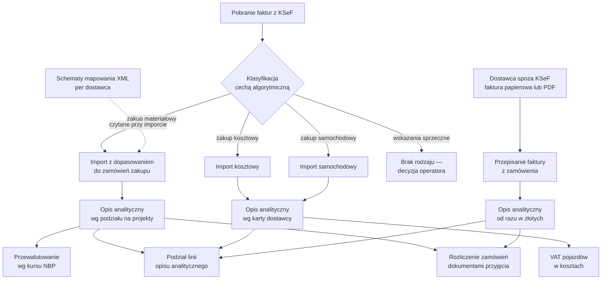

# Obieg faktur zakupu z KSeF w enova365 — mapa rozwiązania

Mapa kompletnego rozwiązania automatyzującego obieg faktur zakupu
odbieranych przez **Krajowy System e-Faktur (KSeF)** w systemie ERP
**enova365** (Soneta sp. z o.o.): od pliku pobranego z KSeF, przez
klasyfikację i import, po gotowy dokument ewidencji z pełną dekretacją
kontrolingową.

Rozwiązanie składa się z **cech konfiguracyjnych w bazie** i **dodatków
(DLL)**, z których każdy odpowiada za jeden krok obiegu i ma własne
repozytorium z opisem. To repozytorium jest punktem wejścia — spina
elementy w jeden proces i pokazuje, co po czym następuje.

Wszystkie repozytoria zawierają wyłącznie **opisy funkcjonalne** — bez
kodu źródłowego, bez danych klientów, bez konfiguracji wdrożeniowej.

Druga rodzina opisuje **stronę sprzedażową** — kartotekę, dokumenty źródłowe
i fakturowanie:
→ [Kartoteka, sprzedaż i fakturowanie — mapa rozwiązania](../../trynityeu/enova365-obieg-sprzedazy-i-kartoteki)

Mapa obejmuje cały obieg: od klasyfikacji, przez trzy ścieżki importu, po
domknięcie pętli zamówienie → dostawa → faktura.

## Obieg w całości

## Krok po kroku

| # | Krok | Element | Postać |
|---|---|---|---|
| 1 | **Pobranie faktur z KSeF** | mechanizm wbudowany w enova365 | — |
| 2 | **Klasyfikacja** — rodzaj dokumentu przypisywany automatycznie przy pobraniu, plus cechy podglądowe umożliwiające weryfikację bez otwierania plików | [Automatyczna klasyfikacja faktur KSeF](../../trynityeu/enova365-klasyfikacja-faktur-ksef) | cechy w bazie |
| 3 | **Utrzymanie schematów mapowania XML** dla dostawców faktur materiałowych — narzędzie administracyjne, nie importuje niczego | [Administracja mapowaniem pól faktury](../../trynityeu/enova365-mapowanie-pol-faktury-ksef) | dodatek |
| 4a | **Import faktur materiałowych** — dopasowanie pozycji do zamówień zakupu, tabela weryfikacyjna, powiadomienia o błędach blokujących | [Import z dopasowaniem do zamówień](../../trynityeu/enova365-import-faktur-ksef-dopasowanie) | dodatek |
| 4b | **Import faktur kosztowych i samochodowych** — rozpoznanie wariantu faktury, dekretacja z karty kontrahenta, bez wyboru matrycy | [Import faktur kosztowych i samochodowych](../../trynityeu/enova365-import-faktur-ksef-koszty-pojazdy) | dodatek |
| 5 | **Rozbicie kosztu na projekty** — podział opisu analitycznego wg rozpisania zamówień na projekty, wywoływany automatycznie zaraz po imporcie | część [importu z dopasowaniem do zamówień](../../trynityeu/enova365-import-faktur-ksef-dopasowanie) | dodatek |
| 6 | **Przewalutowanie** — dla faktur w walucie obcej przeliczenie opisu analitycznego na złote po kursie średnim NBP z dnia poprzedzającego datę dokumentu | [Przewalutowanie wg kursu NBP](../../trynityeu/enova365-przewalutowanie-opisu-analitycznego-nbp) | dodatek |
| 7 | **VAT pojazdów w kosztach** — dla dokumentów samochodowych doliczenie nieodliczalnej połowy VAT do kwoty kosztu, żeby rozliczenie floty widziało rzeczywisty wydatek | [Nieodliczalny VAT pojazdów w kwocie kosztu](../../trynityeu/enova365-vat-pojazdow-w-kosztach) | dodatek **uniwersalny** |
| 8 | **Ręczna korekta dekretacji** — podział pojedynczej linii opisu analitycznego na 2–50 równych części, z przeniesieniem wszystkich wymiarów i sumą zgodną co do grosza | [Podział linii opisu analitycznego](../../trynityeu/enova365-podzial-linii-opisu-analitycznego) | dodatek **uniwersalny** |
| 9 | **Rozliczenie zamówień** — domknięcie pętli kontrolnej: ile z tego, za co zapłaciła faktura, faktycznie przyjął magazyn; wynik jako procent na każdej linii i średnia ważona na dokumencie | [Rozliczenie zamówień dostawami](../../trynityeu/enova365-rozliczenie-zamowien-dostawami) | dodatek |
| — | **Ścieżka równoległa: dostawcy spoza KSeF** — faktura przepisywana z papieru lub PDF formularzem, ale powiązanie z zamówieniami, przeliczenie na złote, podział na projekty i rozliczenie pozycji wykonuje dodatek. Opis analityczny powstaje **od razu w złotych**, więc krok 6 nie jest tu potrzebny | [Przepisanie faktury dostawcy spoza KSeF](../../trynityeu/enova365-zamowienie-do-ewidencji-poza-ksef) | dodatek |

## Trzy warstwy rozwiązania

**Konfiguracja w bazie (kroki 1–3)** rozstrzyga, *czym jest* dana faktura
i *jak ją czytać*. Świadomie trzymana jako dane, nie kod: dodanie
dostawcy o nietypowym formacie faktury albo zmiana klasyfikacji nie
wymaga nowej wersji żadnego dodatku.

**Import (krok 4)** zamienia plik XML w dokument księgowy. Dwie odrębne
ścieżki, bo to dwa różne procesy: faktura materiałowa musi zgadzać się
z zamówieniem (co, ile, po ile), faktura kosztowa nie ma zamówienia i
dekretuje się wg stałego przypisania dostawcy.

**Obróbka dokumentu (kroki 5–9)** doprowadza dekretację do postaci
docelowej — podział na projekty, waluta, VAT, ręczne korekty — i domyka
pętlę kontrolną między zamówieniem, dostawą a fakturą.

## Dodatki uniwersalne a dodatki jednego wdrożenia

Rozwiązanie jest przygotowane na **kilka niezależnych baz** o różnej
konfiguracji planu kont, rodzajów dokumentów i wymiarów kontrolingowych.
Dodatki dzielą się z tego powodu na dwie grupy:

| Grupa | Charakterystyka | Przykłady |
|---|---|---|
| **Uniwersalne** | Bez założeń o konkretnym wdrożeniu — działają wszędzie tam, gdzie istnieją standardowe obiekty enova365 | [podział linii opisu analitycznego](../../trynityeu/enova365-podzial-linii-opisu-analitycznego), [VAT pojazdów w kosztach](../../trynityeu/enova365-vat-pojazdow-w-kosztach) |
| **Wdrożeniowe** | Zawierają reguły księgowe jednego wdrożenia (symbole rodzajów, definicje dokumentów, zestaw wymiarów) | importy KSeF, przebudowa opisu analitycznego |

Dodatki uniwersalne są tu widoczne po jednej rzeczy: **nie odwołują się do
żadnej nazwy wymiaru wpisanej w kod**. Podział linii przenosi te wymiary,
które w danej bazie istnieją, odczytując je z definicji cech — nowy wymiar
kontrolingowy nie wymaga nowej wersji dodatku. Przeliczenie VAT pojazdów
bierze kryterium odliczenia z kartoteki pojazdów, nie z listy w kodzie.
Dzięki temu oba działają w obu wdrożeniach bez wariantów.

Ma to konsekwencję, którą trzeba było obsłużyć jawnie: ten sam zestaw
dodatków bywa wgrany do kilku baz, a rodzaje dokumentów mają w nich
**identyczne symbole przy różnych regułach księgowania**. Dodatki
wdrożeniowe rozpoznają więc bazę, dla której powstały, i w obcej bazie
**nie uruchamiają się w ogóle** — zamiast zaksięgować dokument według
cudzych reguł, nie robią nic. Podobnie przycisk narzędzia
administracyjnego chowa się w bazie, w której nie zdefiniowano
wymaganej cechy.

## Zasady wspólne dla wszystkich elementów

- **Wersjonowanie datowe** `RRRR.M.D.N` (N = numer buildu w danym dniu),
  identyczne w pliku projektu, w metadanych zbudowanej biblioteki i w
  znaczniku wydania — po numerze widocznym w środowisku produkcyjnym da
  się jednoznacznie odnaleźć źródło.
- **Changelog po polsku** w każdym repozytorium, w formacie
  [Keep a Changelog](https://keepachangelog.com/pl/1.1.0/), uzupełniany
  automatycznie przy wydaniu — pierwsza linia commitu staje się wpisem,
  więc opis zmiany powstaje raz.
- **Dokumentacja wdrożeniowa** — każdy dodatek ma opracowanie opisujące
  działanie, konfigurację, wymagane cechy i procedurę wdrożenia, w
  formacie edytowalnym i do druku. Dokumentacja jest przekazywana wraz
  z dodatkiem: klient ma pozostać niezależny od autora.
- **Instalacja przez interfejs enova365** (Narzędzia → Opcje → Dodatki),
  bez wymogu podpisu cyfrowego. Biblioteka przechowywana jest w bazie
  danych — kopiowanie pliku do katalogu lokalnego niczego nie wdraża.
- **Dane klientów nie wchodzą do repozytoriów** — ani do prywatnych, ani
  tym bardziej do publicznych opisów.

## Zgodność

| | |
|---|---|
| System | enova365 (Soneta sp. z o.o.), wersja referencyjna **2512.9.10** |
| Platforma | .NET 8 |
| Schemat faktury | KSeF **FA(3)** |
| Moduły enova365 | Handel, Księga, Ewidencja VAT, CRM, integracja KSeF |

## Czego tu nie ma

Kod źródłowy, dane handlowe, dane osobowe, treść schematów dostawców,
konfiguracja środowisk i dokumentacja wdrożeniowa pozostają w
repozytoriach prywatnych. Publiczne repozytoria tej rodziny służą
wyłącznie opisowi działania.
